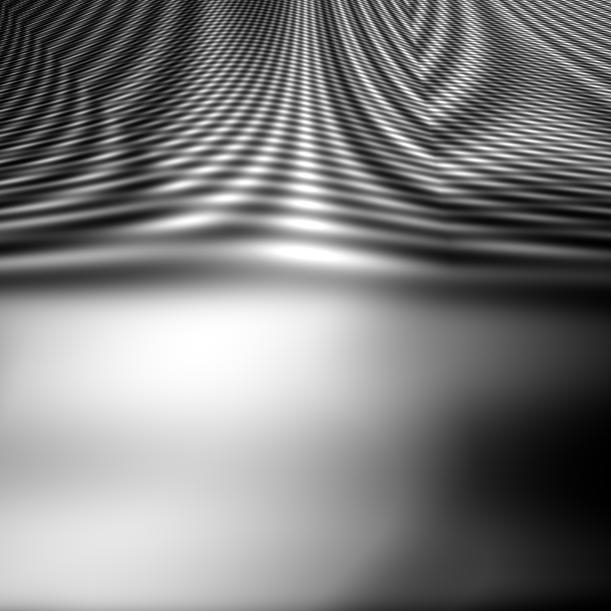

Generating Images using Genetic Programming
===========================================

Creamas offers some ready made objects to start producing images using genetic programming (GP), which can be found from
:py:mod:`~creamas.domains.image.gp` package. They are coupled with image evaluation features from
:py:mod:`~creamas.domains.image.features` module. The functionality is based on
`DEAP library <https://deap.readthedocs.io/en/master/>`_.

Below is a simple example of creating images using :class:`~creamas.domains.image.gp.generator.GPImageGenerator`.

.. code-block:: python

    from creamas.domains.image.features import ImageEntropyFeature
    from creamas.domains.image.gp import tools
    from creamas.domains.image import gp

    # Create a primitive set for DEAP.
    pset = tools.create_super_pset(bw=True)
    # Create a DEAP toolbox with some reasonable default values for quick testing.
    toolbox = tools.create_toolbox(pset)

    # Choose a feature which should be maximised and create an evaluation function for it
    # (Remember that evaluation function should also return possible framing for the artifact.
    feat = ImageEntropyFeature()

    def evaluate_func(artifact):
        # Filter out uninteresting images
        if gp.GPImageArtifact.png_compression_ratio(artifact) <= 0.08:
            return 0.0, None
        return feat(artifact), None

    # Create a GP image generator, which adds 'name' as created artifacts' creators.
    # If each agent has its own generator, 'name' should be different for each agent.
    # Using e.g. util.sanitize_agent_name(agent.name) is a good choice.
    gpgen = gp.GPImageGenerator('name', toolbox, pset, 40, 20, evaluate_func, (32, 32))
    # Run evolution with given parameters and return the best artifact
    arts = gpgen.generate()
    art = arts[0][0]
    img = art.obj
    # Save the artifact as an image and the function used to generate it. Functions can be used again to generate the
    # image from same function in different sizes, or to induce succesive GP runs.
    gp.GPImageArtifact.save(art, 'test_image.png', pset, shape=(400, 400), string_file='test_image.txt')

For example, the code above has been used to generate the following image:

Check out :doc:`GP documentation<domains>` for details on how to use the functionality.